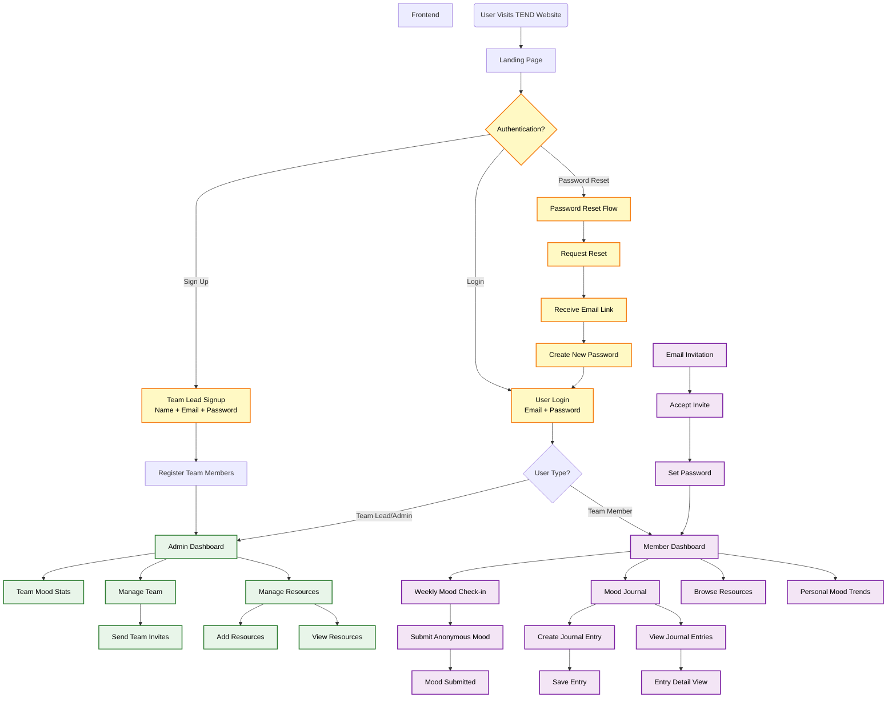

This is a [Next.js](https://nextjs.org) project bootstrapped with [`create-next-app`](https://nextjs.org/docs/app/api-reference/cli/create-next-app).

# Tend – Remote Team Wellness Tracker

Tend is a digital wellness platform that helps remote teams stay connected, balanced, and supported. Through anonymous weekly mood and energy check-ins. Tend gives teams a safe way to express how they’re doing and helps leaders/admins track wellness trends over time — without compromising anyone’s privacy.

---

## Project Goals

- Enable **weekly anonymous mood check-ins**
- Visualize **team wellness trends** via an admin dashboard
- Offer **wellness resources** for team members
- Ensure **privacy and anonymity** throughout the user experience
- Encourage consistency through **email or in-app (pop-ups)nudges**

---

## Problem Statement

Remote teams often struggle with:
- Burnout
- Disconnection
- Undetected stress or disengagement

Tend helps bridge that gap by providing insights into team morale, while keeping individual identities private.

---

## Core Features

### For Team Members
- Anonymous weekly check-in (mood + energy)
- In-app or email nudges to check in
- Personal mood journal *(optional)*
- Curated wellness resources

### For Admins
- Dashboard showing team wellness trends
- Visuals for mood and energy over time
- Insights to guide team support actions

---

## Tech Stack

### Frontend
- **Next.js (App Router)** – Framework for routing, rendering, and API routes
- **TypeScript** – Static typing for scalable development
- **Tailwind CSS** – Utility-first styling
- **ShadCN UI** – Accessible and pre-built UI components
- **React Query** – Server-state management for API data
- **React Hook Form + zod** – Form handling and validation
- **Chart.js / Recharts** – Trend visualizations
- **Axios** – HTTP client for API requests

### Backend (Pluggable)


### DevOps
- **Vercel** – Frontend deployment
- **GitHub Actions** – CI/CD pipelines

---

## Project Structure
```bash
tend-wellness-tracker/
├── app/                     # App Router structure
│   ├── (landing)/           # Landing page group
│   │   ├── page.tsx         # Homepage          
│   │   └── layout.tsx       # Landing page layout with header/footer
│   ├── auth/                # Authentication routes
│   │   ├── login/           # Login page
│   │   ├── signup/          # Signup page
│   │   └── reset-password/  # Password reset flow
│   ├── admin/               # Admin portal (protected)
│   │   ├── dashboard/       # Dashboard home
│   │   ├── resources/       # Resource management
│   │   ├── team/            # Team management
│   │   └── layout.tsx       # Admin layout with sidebar
│   ├── member/              # Team member portal (protected)
│   │   ├── check-in/        # Weekly check-in
│   │   ├── journal/         # Mood journal
│   │   ├── resources/       # View resources
│   │   └── layout.tsx       # Member layout
│   ├── api/                 # API routes
│   │   ├── auth/            # Auth endpoints
│   │   ├── admin/           # Admin endpoints
│   │   └── member/          # Member endpoints
│   └── layout.tsx           # Root layout
├── components/              # Shared UI components
├── lib/                     # Utility functions, API clients
├── hooks/                   # Custom React hooks
├── providers/               # Context providers
├── types/                   # TypeScript interfaces, enums, and types
│   ├── auth.ts              # Login/signup-related types
│   ├── user.ts              # User and admin types
│   ├── mood.ts              # Mood, energy, check-in types
│   ├── journal.ts           # Mood journal entry types
│   └── resource.ts          # Wellness resource types
└── public/                  # Static assets
```

---

## System Architecture (User flow)



## Security & Privacy

---

## Project Timeline (12 Weeks)

| Phase               | Weeks     | Activities                                  |
|---------------------|-----------|-------------------------------------------- |
| Discovery & Planning| 1–2       | Define scope, research, competitor analysis |
| UI/UX Design        | 3–4       | Wireframes, feedback, finalize UI           |
| Frontend Dev        | 5–6       | Build check-in form and dashboard UI        |
| Backend Dev         | 7–8       | Setup APIs, database, anonymization logic   |
| Testing & QA        | 9–10      | Internal testing, bug fixing                |
| Soft Launch (Beta)  | 11        | Beta test, monitor feedback                 |
| Public Launch       | 12        | Full release, post-launch support           |

---

## Getting Started

First, run the development server:

```bash
npm run dev
# or
yarn dev
# or
pnpm dev
# or
bun dev
```

Open [http://localhost:3000](http://localhost:3000) with your browser to see the result.

You can start editing the page by modifying `app/page.tsx`. The page auto-updates as you edit the file.

This project uses [`next/font`](https://nextjs.org/docs/app/building-your-application/optimizing/fonts) to automatically optimize and load [Geist](https://vercel.com/font), a new font family for Vercel.

## Build Command
```bash
npm run build
```

## Run Lint/Format
```bash
npm run lint
npm run format
```

## Deploy on Vercel

The easiest way to deploy your Next.js app is to use the [Vercel Platform](https://vercel.com/new?utm_medium=default-template&filter=next.js&utm_source=create-next-app&utm_campaign=create-next-app-readme) from the creators of Next.js.

Check out our [Next.js deployment documentation](https://nextjs.org/docs/app/building-your-application/deploying) for more details.

---

## Contributors

### Team TEND
**Project Manager**: David Ọlámidé Akínpẹ̀lú [Team Member]

**Product Lead**: FAVOUR WILLIAMZ IDIKWU [Team Member]

**UI/UX**: Ehalodu Jeffery Agbonsa [Team Member]

**Frontend Engineer**: Blessing Dawodu [Team Member]

**Backend Engineer**: Mugisha Alain [Team Member]

**Software Tester**: Adaora Loveth [Team Member]

---

## Inspiration
Tend is built to promote psychological safety, reduce burnout, and bring empathy into remote workplaces — because mental wellness should be a team priority.